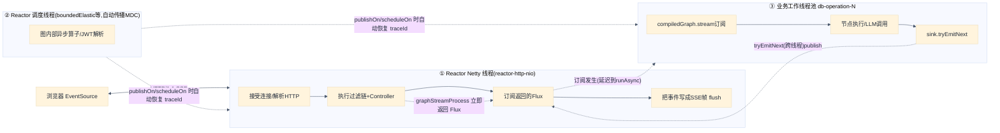
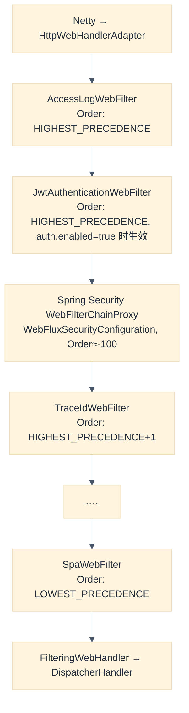
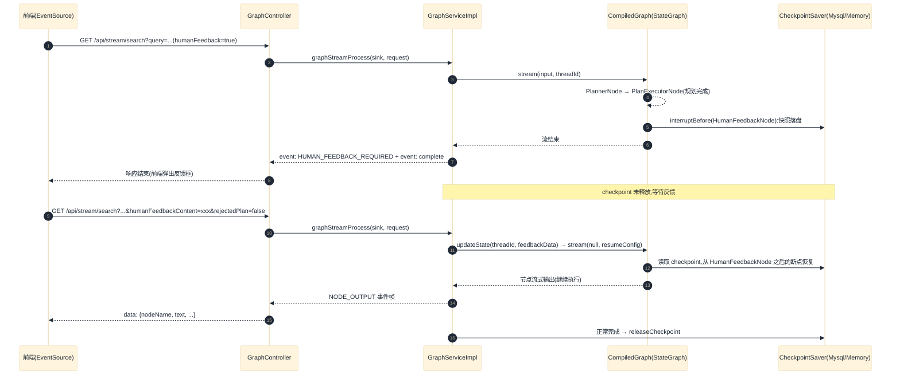

# 后端 Web 框架工作原理(WebFlux 全链路)

本文档梳理后端 `data-agent-management` 的 Web 框架工作原理:从用户发起一次对话 API 调用开始,到整条对话在图工作流(StateGraph)中流转、以 SSE 流式返回前端的完整过程,并重点剖析 Spring WebFlux 的工作机制(非阻塞 IO、Reactor 背压、Sinks 桥接、过滤链、线程模型)。

> 适用版本:Spring Boot 3.4.8、Spring WebFlux(Reactor Netty)、`spring-ai-alibaba-graph-core 1.1.2.2`。
> 本文档中的所有结论均锚定源码,引用格式为 `文件路径:行号`(相对于 `data-agent-management/src/main/java/` 或 `data-agent-frontend-nuxt/`)。

## 目录

1. [总体架构与线程模型](#1-总体架构与线程模型)
2. [HTTP 接入层:Reactor Netty 如何接收请求](#2-http-接入层reactor-netty-如何接收请求)
3. [WebFilter 过滤链:请求预处理](#3-webfilter-过滤链请求预处理)
4. [DispatcherHandler:路由到 GraphController](#4-dispatcherhandler路由到-graphcontroller)
5. [GraphController:SSE 会话建立与 Sinks 桥接](#5-graphcontrollersse-会话建立与-sinks-桥接)
6. [StateGraph 图工作流:业务如何流转](#6-stategraph-图工作流业务如何流转)
7. [GraphServiceImpl:线程桥接与生命周期管理](#7-graphserviceimpl线程桥接与生命周期管理)
8. [一次完整对话的时序](#8-一次完整对话的时序)
9. [WebFlux 核心机制剖析](#9-webflux-核心机制剖析)
10. [附录:关键类、配置与源码索引](#10-附录关键类配置与源码索引)

---

## 1. 总体架构与线程模型

### 1.1 技术栈

- **Web 层**:`spring-boot-starter-webflux`(`data-agent-management/pom.xml:314`),运行时容器为 **Reactor Netty**;服务端口 `8065`(`application.yml:1-2`)。项目没有引入 `spring-boot-starter-web`,是纯响应式栈。
- **工作流层**:Spring AI Alibaba `spring-ai-alibaba-graph-core`(版本 `1.1.2.2`,见根 `pom.xml:24`),即 LangGraph 风格的 `StateGraph`,由 `DataAgentConfiguration` 装配,由 `GraphServiceImpl` 驱动。
- **安全层**:Spring Security WebFlux(`WebFluxSecurityConfiguration`)+ 自定义 JWT 过滤器(`JwtAuthenticationWebFilter`)。
- **流式输出**:HTTP SSE(`text/event-stream`),使用 Spring AI Alibaba Graph 的 `Flux<NodeOutput>` 逐块吐词。

### 1.2 三层线程模型

一次对话请求全程横跨三类线程,这是理解 WebFlux 的关键:



- **① Netty EventLoop 线程**:只做接收请求、跑 WebFilter/Handler、写响应,任何一步都不允许阻塞(阻塞会卡死整个 EventLoop 上的所有连接)。
- **② Reactor 调度线程**(`boundedElastic` 等):Reactor `publishOn`/`subscribeOn` 切换线程边界时的载体;项目通过 `Schedulers.addExecutorServiceDecorator` 和 `Hooks.enableAutomaticContextPropagation()` 保证 traceId/MDC 跨这些边界自动传播(见 `config/DataAgentConfiguration.java:456-471`)。
- **③ 业务工作线程池**:`dbOperationExecutor`(`DataAgentConfiguration.java:473-502`)——线程名 `db-operation-N`,4~16 个线程、队列 500、`CallerRunsPolicy`,被 `MdcPropagatingExecutorService` 包装以透传 traceId。图工作流的订阅与执行发生在这里,与 Netty 线程完全解耦。

---

## 2. HTTP 接入层:Reactor Netty 如何接收请求

1. **TCP 连接建立**:Reactor Netty 的 `HttpServer` 运行在 Netty 的 EventLoopGroup 上。每个 EventLoop 是一个单线程事件循环,挂载多个 Channel(连接),以 NIO(epoll/kqueue,Windows 上为 NIO)多路复用的方式处理 IO 事件,因此**一个线程可以服务成千上万个并发连接**,而不是每连接一线程。
2. **HTTP 解析与组装**:Netty 的 `HttpRequestDecoder`/`HttpObjectAggregator` 把字节流解析为目标+头+体,交给 Reactor Netty 的 `HttpServerHandle`,再适配为一个 Spring `ReactiveHttpInputMessage`/`ReactiveHttpOutputMessage`。
3. **WebHandler 适配链**:Reactor Netty 的 handler 最终调用 Spring 的 `WebHandler`,自外向内依次是:

   ```
   HttpWebHandlerAdapter
     └─> ExceptionHandlingWebHandler        (把内层异常统一翻译为 HTTP 错误响应)
           └─> FilteringWebHandler          (持有 DefaultWebFilterChain:按 @Order 编排所有 WebFilter)
                 └─> DispatcherHandler      (WebFlux 版本的"前端控制器")
   ```

4. **ServerWebExchange**:每个请求封装为一个 `ServerWebExchange`,持有 `ServerHttpRequest`/`ServerHttpResponse`。请求头、Cookie、URI 一次解析完成,是过滤器和服务层之间传递请求上下文的唯一载体(WebFlux 中没有 Servlet 的 `HttpServletRequest`)。

> 与传统 Servlet 容器的区别:Tomcat 是"每请求一线程、线程内阻塞式流";Reactor Netty 是"少量事件循环线程 + 所有 IO 非阻塞",线程数是 CPU 核数级而非并发连接数级。

---

## 3. WebFilter 过滤链:请求预处理

Spring Boot 收集所有实现 `WebFilter` 的 Bean,按 `@Order` 排序组成 `DefaultWebFilterChain`。本项目注册了 4 个自定义 WebFilter(均在 `com.alibaba.cloud.ai.dataagent.filter` 包),外加一条 Spring Security 过滤链。

### 3.1 执行顺序



| Filter | Order | 职责 | 源码 |
| --- | --- | --- | --- |
| `AccessLogWebFilter` | `HIGHEST_PRECEDENCE` | 请求完成后写 `ACCESS_LOG`(方法、URI、状态码、耗时、客户端 IP),`doFinally` 兜底执行 | `filter/AccessLogWebFilter.java:39-55` |
| `JwtAuthenticationWebFilter` | `HIGHEST_PRECEDENCE` | 解析 JWT(Authorization 头 / Bearer Cookie / URL 参数)或签名用户 Cookie,把用户写入 `UserContextHolder`,失败返回 401;默认关闭,由 `data-agent.auth.enabled=true` 开启 | `filter/JwtAuthenticationWebFilter.java:47-114` |
| Spring Security `WebFilterChainProxy` | ≈ -100(先于业务 Filter) | 仅对 `GET /api/stream/search` 启用 API-Key 认证,其余路径一律放行 | `config/WebFluxSecurityConfiguration.java:45-73` |
| `TraceIdWebFilter` | `HIGHEST_PRECEDENCE + 1` | 将 userId 作为 traceId 写入 MDC,链式执行完成后 `doFinally` 清理 | `filter/TraceIdWebFilter.java:38-47` |
| `SpaWebFilter` | `LOWEST_PRECEDENCE` | SPA 前端路由回退:非静态/非 API 路径回退到 `static/front/index.html` | `filter/SpaWebFilter.java:30-51` |

### 3.2 MDC 与 traceId 的传播(WebFlux 的经典难点)

WebFlux 中请求在**多个线程之间流转**,而 MDC 是线程局部变量,天然"线程不亲和"。本项目用三层手段解决:

1. **请求线程内**:`TraceIdWebFilter` 在过滤链开始时 `TraceIdMdcUtil.put(traceId)`。
2. **显式跨线程**:`MdcPropagatingExecutorService`(`util/MdcPropagatingExecutorService.java`)在任务提交时用 Micrometer `ContextSnapshot` 捕获 traceId,执行时恢复 —— 装饰了 `dbOperationExecutor` 线程池。
3. **隐式跨线程(兜底)**:`DataAgentConfiguration.registerTraceIdAccessor()`(:468)向 Micrometer `ContextRegistry` 注册 `TraceIdThreadLocalAccessor` 并 `Hooks.enableAutomaticContextPropagation()`;`registerMdcSchedulerDecorator()`(:457)给所有 Reactor Scheduler 装上了 `MdcPropagatingScheduledExecutorService` 装饰器。这样 `publishOn`/`subscribeOn`/`boundedElastic` 等任何线程边界都会自动恢复 traceId,日志全程可串。

### 3.3 安全链(WebFlux Security)

`WebFluxSecurityConfiguration` 定义 `SecurityWebFilterChain`(:45):

- 用 `AuthenticationWebFilter` 挂载 API-Key 认证(`AgentApiKeyReactiveAuthenticationManager` + `AgentApiKeyServerAuthenticationConverter`),仅匹配 `GET /api/stream/search`;`NoOpServerSecurityContextRepository`(无会话)。
- 授权规则:`pathMatchers(GET, "/api/stream/search").authenticated()`,其余 `permitAll`(:66-69)。即**只有对话流接口走 API-Key 认证,其余 REST 接口由独立控制台的路由/网关场景使用**。
- JWT 用户认证由 `JwtAuthenticationWebFilter` 独立完成,不经过 Spring Security 的认证管理器,解析结果同时写入 exchange attribute 与 Reactor Context,后续任意环节通过 `UserContextHolder.getCurrentUserId(exchange)` 获取。

---

## 4. DispatcherHandler:路由到 GraphController

过滤链尾部,`FilteringWebHandler` 把请求交给 `DispatcherHandler`(WebFlux 的中央调度器)。它按序执行:

1. **HandlerMapping**:以 `RequestMappingHandlerMapping` 为主,根据 `@RequestMapping` 的路径+方法匹配到 `GraphController.streamSearch`(GET `/api/stream/search`,produces `text/event-stream`)。
2. **HandlerAdapter**:`RequestMappingHandlerAdapter` 调用目标方法。注意在 WebFlux 中,Controller 方法**实际参数**只来自方法签名(如 `ServerHttpResponse response`、`ServerWebExchange exchange` 会被框架注入),返回值必须是 `Mono`/`Flux` 或可由适配器包装的类型。
3. **HandlerResultHandler**:对返回 `Flux<ServerSentEvent<T>>` 的响应结果,`ResponseBodyResultHandler` 选择匹配 `text/event-stream` 的 `ServerSentEventHttpMessageWriter` 序列化输出。

> 关键认知:**Handler 方法返回 Flux/Mono 时,业务逻辑此刻尚未执行**——返回的只是一个"冷"的声明式数据流,由 ResponseBodyResultHandler 订阅它,执行才真正开始,输出则在下游逐块消费。

---

## 5. GraphController:SSE 会话建立与 Sinks 桥接

`GraphController.streamSearch`(`controller/GraphController.java:57-126`)是对话流程的 Web 层核心:

### 5.1 建立响应

```java
@GetMapping(value = "/stream/search", produces = MediaType.TEXT_EVENT_STREAM_VALUE)
public Flux<ServerSentEvent<GraphNodeResponse>> streamSearch(..., ServerHttpResponse response, ServerWebExchange exchange)
```

1. 设置 SSE 专属响应头:`Cache-Control: no-cache`、`Connection: keep-alive`(浏览器 EventSource 要求)。
2. **会话归属校验**:携带 `conversationId` 且当前用户存在时,用 `ChatSessionService.findBySessionId(conversationId, userId)` 校验会话归属,查不到则响应 403 + 空流(:72-78)。
3. **创建 Sinks 桥**:

   ```java
   Sinks.Many<ServerSentEvent<GraphNodeResponse>> sink =
       Sinks.many().unicast().onBackpressureBuffer();   // :80
   ```

   `Sinks.many().unicast()` 是本设计最精巧的一环:它把"**谁产生数据**"(图工作线程)和"**谁消费数据**"(Netty 写响应线程)彻底解耦。`GraphController` 把这个 sink 连同业务参数一起交给 `GraphServiceImpl.graphStreamProcess(sink, request)`,随后立即把 `sink.asFlux()` 返回给框架 —— 此时 HTTP 请求处理就返回了,Netty 线程重获自由。

### 5.2 返回流的组装(背压与生命周期)

`GraphController` 返回的 Flux 并不直接裸暴露 sink,而是叠加了一层**过滤 + 生命周期钩子** (:96-125):

- **过滤空块**:只有 `complete`/`error` 事件、协议事件(带 `eventType` 的非 `NODE_OUTPUT` 事件)、以及非空 `text`,才放行给前端。
- `doOnSubscribe`:记录客户端开始订阅(并在 traceId 的 MDC 上下文中打日志)。
- `doOnCancel`:**客户端断开连接**(EventSource 关闭/断网)时,调用 `graphService.stopStreamProcessing(threadId)` 做后端清理。
- `doOnError`:图执行出错时记录日志并调用 `stopStreamProcessing` 兜底。
- `doOnComplete`:正常结束日志。

### 5.3 SSE 帧编码

`ServerSentEventHttpMessageWriter` 负责把 `Flux<ServerSentEvent<GraphNodeResponse>>` 的每个事件编码为 SSE 帧写回:

```
event: complete(可选)
data: {"agentId":..., "threadId":..., "nodeName":..., "text":..., ...}\n\n
```

每发一帧立即 flush(SSE 语义要求),客户端逐帧接收。

### 5.4 配套接口

- `POST /api/stream/stop`(:128-138):前端主动停止 —— 按 `threadId` 精确停止,或按 `conversationId` 停止其下所有流。

---

## 6. StateGraph 图工作流:业务如何流转

### 6.1 图的装配(`DataAgentConfiguration.nl2sqlGraph`)

`config/DataAgentConfiguration.java:156-302` 用 Spring AI Alibaba Graph 的 `StateGraph` 声明式装配了一张 16 节点的有向图。所有状态键声明为 `KeyStrategy.REPLACE`(:159-221),即同一键的两次写入互相覆盖(每条流式对话独立成图实例,键不需累积)。

节点(:224-239,均通过 `NodeBeanUtil.getNodeBeanAsync` 注册为 `AsyncNodeAction`):

```
START → IntentRecognitionNode(意图识别)
   ├─ 证据召回链:EvidenceRecallNode → QueryEnhanceNode → SchemaRecallNode
   │              → TableRelationNode ⟲(自环重试)→ FeasibilityAssessmentNode(可行性评估)
   └─ 或直接 END
→ PlannerNode(任务规划) → PlanExecutorNode(计划校验/分发)
   ├─ → SqlGenerateNode → SemanticConsistencyNode → SqlExecuteNode → 回 PlanExecutorNode
   ├─ → PythonGenerateNode → PythonExecuteNode → PythonAnalyzeNode → 回 PlanExecutorNode
   ├─ → ReportGeneratorNode(报告生成)
   ├─ → HumanFeedbackNode ⇄(人工评审,见 6.3)
   └─ → END
```

条件边由 `workflow/dispatcher` 包下的路由器决定走向,例如 `IntentRecognitionDispatcher`(意图不符合数据问答则直接 END)、`SqlGenerateDispatcher`(SQL 生成失败则自环重试)、`PlanExecutorDispatcher`(计划验证失败回 PlannerNode 修复;全部步骤完成则 END)等。

### 6.2 CompileConfig 与 Checkpoint

`nl2sqlGraphCompileConfig`(:327-335)在编译时启用两个关键能力:

- **Checkpoint 持久化**:`SaverConfig.register(checkpointSaver)`。生产环境用 `MysqlSaver`(`checkpoint.type=mysql`,默认),把每个 `threadId` 的图状态快照持久化;`checkpoint.type=memory` 时退化为 `MemorySaver`。
- **人工评审断点**:`.interruptBefore(HUMAN_FEEDBACK_NODE)` —— 当图执行到 `HumanFeedbackNode` 前**主动中断**,把状态快照落盘并结束本轮流,等待用户反馈后从断点恢复。
- **可观测性**:`.withLifecycleListener(nodeTracingLifecycleListener)` 把节点级生命周期上报 Langfuse。

### 6.3 人工评审暂停/恢复(Checkpoint 的价值)

这是本架构中最能体现"图状态机 + Web 长连接"配合的场景:



**中断判断**:`handleStreamComplete` 通过 `checkpointSaver.get(config)` 读取快照的 `nextNodeId`,若等于 `HUMAN_FEEDBACK_NODE` 则视为"等待人工反馈",保留 checkpoint;否则释放(`service/graph/GraphServiceImpl.java:433-455`)。

**恢复执行**:第二次请求携带 `humanFeedbackContent` 时,`GraphServiceImpl.handleHumanFeedback`(:190-234)先 `compiledGraph.updateState` 合并反馈,再以携带 `HUMAN_FEEDBACK_METADATA_KEY` 的 `resumeConfig` 调用 `compiledGraph.stream(null, resumeConfig)` 从断点继续。

---

## 7. GraphServiceImpl:线程桥接与生命周期管理

`service/graph/GraphServiceImpl.java` 是 Web 层与图引擎之间的"翻译官"。它维护每线程一串流上下文,并保证所有跨线程状态一致。

### 7.1 核心结构

```java
private final ConcurrentHashMap<String, StreamContext> streamContextMap = new ConcurrentHashMap<>(); // :61
```

`StreamContext`(`service/graph/Context/StreamContext.java`)封装一条流的全部状态:

| 字段 | 作用 |
| --- | --- |
| `sink` | 该 threadId 专属的发布端(来自 GraphController) |
| `disposable` | 图 Flux 的订阅句柄,用于停止时 dispose |
| `span` | Langfuse 根 span |
| `textType` | 当前文本类型(普通文本 / SQL / 结果集 / Markdown / HTML 报告),用于识别切换标记 |
| `finalAnswer` | 最终答案,完成时一次性下发 |
| `nodeAttempts` / `activeStepId` / `stepSequence` | 生成前端分组用的 `stepId`(`节点名-序号`)与重试 `attempt`,见 `resolveStep`(:62-69) |
| `cleaned` | `AtomicBoolean` 保证清理只执行一次 |

### 7.2 新对话:handleNewProcess(:157-188)

1. 参数完整性校验(threadId/conversationId/agentId/query,缺一抛 `IllegalArgumentException`)。
2. 启动 Langfuse 追踪 span。
3. 从 `MultiTurnContextManager` 取多轮上下文(聊天历史),`beginTurn` 开启新一轮跟踪。
4. 构建图输入 Map:`IS_ONLY_NL2SQL / INPUT_KEY / AGENT_ID / HUMAN_REVIEW_ENABLED / MULTI_TURN_CONTEXT / TRACE_THREAD_ID`,调用 `compiledGraph.stream(input, RunnableConfig.threadId(threadId))` 得到一个 **`Flux<NodeOutput>` 冷流**。
5. `subscribeToFlux`(:244-268):在 `dbOperationExecutor`(经 `TraceIdMdcUtil.wrap` 包装以携带 MDC)上异步 `subscribe` 该 Flux,回调三元组 = `handleNodeOutput`(每块输出)→ `handleStreamError`(出错)→ `handleStreamComplete`(结束)。订阅句柄在 `synchronized` 块内原子性写入 `StreamContext.disposable`,与停止线程的清理操作互斥。

> 为什么必须异步订阅:如果直接在线程①中订阅,图引擎会同步在 Netty 线程上执行节点(LLM 调用动辄数秒),阻塞 EventLoop,违背"Netty 线程零阻塞"的铁律。

### 7.3 节点输出:handleNodeOutput / handleStreamNodeOutput(:357-431)

图引擎每产出一个 `StreamingOutput`(节点流式分块),即回调:

1. 若块的文本是**类型切换标记**(如进入 SQL/结果集/Markdown 段落的标记),只更新 `StreamContext.textType`,不下发前端;否则继续。
2. 普通分块:写入 `outputCollector`(供 Langfuse 汇报)、按 `resolveStep(node)` 计算 `stepId`/`attempt`;若是 `PlannerNode` 的分块,同步 `appendPlannerChunk` 给多轮上下文管理器(历史记录用)。
3. 组装 `GraphNodeResponse`(agentId/threadId/stepId/attempt/nodeName/text/textType),`sink.tryEmitNext(...)` 发布到 SSE 桥。
4. **背压反馈**:`tryEmitNext` 返回 `Sinks.EmitResult`,若失败(最典型的是客户端断开导致的取消),立即 `stopStreamProcessing(threadId)`,停止图执行、清理资源(:423-429)。

### 7.4 完成:handleStreamComplete(:305-352)

图流正常结束时:

1. `MultiTurnContextManager.finishTurn`:把本轮的"用户提问 + Planner 输出"写入 Spring AI `ChatMemory`(历史库),供下一轮 `buildContext` 注入。
2. 判断 `isAwaitingHumanFeedback`:检查 checkpoint 的 `nextNodeId` 是否停在 `HumanFeedbackNode`。
   - 是:发 `HUMAN_FEEDBACK_REQUIRED` 协议事件,并**保留 checkpoint**;
   - 否:调用 `releaseCheckpoint` 清理持久化快照。
3. 结束 Langfuse span(System 聚合 token 统计后上报)。
4. 按序发布剩余事件:`finalAnswer`(如有)→ `complete` 事件(`STREAM_EVENT_COMPLETE`)→ `sink.tryEmitComplete()` 优雅关闭 SSE 流。
5. `context.cleanup()`:dispose 订阅、幂等关 sink。

### 7.5 出错:handleStreamError(:273-300)

记录日志 → `discardPending`(丢弃未完成轮次)→ `releaseCheckpoint` → 结束 Langfuse span(错误态)→ 清理 listener 残留 → 发布 `error` 事件 + `tryEmitComplete` → cleanup。

### 7.6 停止:stopStreamProcessing(:116-143)

由三条路径触发:前端关 EventSource(`doOnCancel`)、`POST /api/stream/stop`、或 `tryEmitNext` 失败。处理流程:

```java
StreamContext context = streamContextMap.remove(threadId); // 原子移除,确保单线程进入
multiTurnContextManager.discardPending(...);               // 丢弃未完成轮次
context:endSpanSuccess; context.cleanup();                 // 结束 span、dispose 订阅
nodeTracingLifecycleListener.discardThread(threadId);      // 清理节点级 span/计数器
releaseCheckpoint(...);                                    // 释放图状态快照
```

`remove` 的原子语义保证了停止、出错、完成三个回调彼此互斥;`StreamContext.cleaned` 的 `AtomicBoolean` 保证 cleanup 幂等。**断线即走"停止"路径**是 WebFlux 模型下资源回收的关键:SSE 长连接断开会被 Netty 转为 x,Flux 取消信号沿订阅链上行,`doOnCancel` 回调即在此火线执行。

### 7.7 多轮上下文:MultiTurnContextManager

`service/graph/Context/MultiTurnContextManager.java` 维护轻量对话记忆:

- `beginTurn`(:59):记录本轮用户提问到 `pendingTurns`(内存)。
- `appendPlannerChunk`(:71):流式追加 PlannerNode 规划分块。
- `finishTurn`(:85):轮次结束,把「用户提问 + AI 计划」写入 Spring AI `ChatMemory`(经 `ChatMemoryRepository` 持久化)。
- `buildContext`(:137):把历史格式化为 `用户: ...\nAI计划: ...` 注入下一轮图输入。
- `restartLastTurn`(:114):方案被人工驳回时,回滚最后一轮历史、以原问题重启。

---

## 8. 一次完整对话的时序

把上述所有环节串起来的端到端时序:

```mermaid
%%{init: {"theme": "base", "themeVariables": {"lineColor": "#475569", "primaryTextColor": "#1F2937"}}}%%
sequenceDiagram
    autonumber
    participant FE as 前端<br/>stores/chat.ts + services/graph
    participant NETTY as Reactor Netty<br/>(EventLoop线程①)
    participant WFS as 过滤链<br/>(AccessLog/JWT/Security/TraceId)
    participant GC as GraphController<br/>(streamSearch)
    participant GS as GraphServiceImpl
    participant G as StateGraph 图引擎<br/>(db-operation线程③)
    participant LLM as LLM/DB/Python沙箱

    FE->>NETTY: EventSource: GET /api/stream/search?agentId=..&conversationId=..&query=..
    NETTY->>WFS: ServerWebExchange(解析完成)
    WFS->>WFS: JWT 解析用户 → UserContextHolder;traceId 入 MDC;API-Key 校验
    WFS->>GC: 路由到 streamSearch
    GC->>GC: 403 会话校验;建 Sinks.unicast().onBackpressureBuffer()
    GC->>GS: graphStreamProcess(sink, request) —— Netty 线程即刻返回!
    GS->>GS: 建 StreamContext;buildContext 取历史
    GS->>G: Async: subscribe compiledGraph.stream(input, threadId)
    GC-->>NETTY: 返回 Flux<ServerSentEvent>;SSE 头写出
    loop 每个节点/每个 LLM 分块
        G->>LLM: 调用 LLM/执行 SQL/沙箱跑 Python(线程③)
        LLM-->>G: 流式分块
        G-->>GS: StreamingOutput(node, chunk)
        GS->>GS: TextType 标记解析;resolveStep → stepId/attempt
        GS->>GC: sink.tryEmitNext(GraphNodeResponse)
        GC->>NETTY: 过滤空块 → SSE 帧 flush(data: {...})
        NETTY-->>FE: 逐帧到达;onmessage 按 stepId 聚合成 nodeBlocks
    end
    G-->>GS: 流结束 → handleStreamComplete
    GS->>GS: finishTurn(写历史);判断是否等待人工反馈
    GS->>GC: complete 事件 + tryEmitComplete
    GC->>NETTY: flush 残留帧
    NETTY-->>FE: event: complete → 保存 timeline/text 消息
    Note over FE,GS: 若客户端中途关闭:TCP断开 → Flux取消 → doOnCancel
    FE--xNETTY: (可选)EventSource.close / 断网
    NETTY->>GC: doOnCancel → stopStreamProcessing(threadId)
    GC->>GS: remove context → dispose 订阅 → 释放 checkpoint → 结束 span
```

前端侧的聚合逻辑(`app/stores/chat.ts` 的 `_sendGraphRequest`,:359-569):

- `GraphService.streamSearch`(`app/services/graph/index.ts:112`)用原生 `EventSource` 订阅:普通帧进 `onmessage` 回调,`complete` 事件关闭连接,`error` 事件报错。
- 按 `stepId` 把同一节点的分块聚合为 `nodeBlocks` 时间线;`ReportGeneratorNode` 的 `HTML`/`MARK_DOWN` 分块做特殊累积(80ms 节流刷新以控制渲染频率)。
- `FINAL_ANSWER` 事件整段缓存,`HUMAN_FEEDBACK_REQUIRED` 事件弹起反馈框,流结束后分别持久化 timeline 消息与文本回复。
- 取消对话框/停止按钮时,调用返回的 `closeStream(cancelRun=true)` → `POST /api/stream/stop`。

---

## 9. WebFlux 核心机制剖析

### 9.1 非阻塞 IO:为什么 Netty 线程要"零阻塞"

`reactor-http-nio` 每个 EventLoop 线程轮询成千上万 Channel。**任何一个 handler 里做了阻塞调用(JDBC、同步 HTTP 客户端),该 EventLoop 上所有连接全部停摆**。本项目两条纪律:

- Web 层方法全部返回 `Mono`/`Flux`,IO 一律走 WebClient/R2DBC/响应式栈;
- 图进程执行(动辄数秒~数分钟的 LLM 调用)被扔进 `db-operation-N` 线程池异步跑,Netty 线程发出请求即刻返回,SSE 的写回由 Reactor 灰度通知。

### 9.2 Reactor 背压与 Sinks

- **背压(Backpressure)**:`Flux` 是推拉结合模型 —— 下游按处理能力 `request(n)` 拉取。Netty 写端未就绪时会延迟请求,反向传递到上游。
- **Sinks 桥**:`Sinks.many().unicast().onBackpressureBuffer()` 允许"多生产者语义、单订阅者"的发布;`onBackpressureBuffer` 表示订阅者来不及消费时先**缓冲**(图引擎侧不阻塞)。发布方用 `tryEmitNext`(而非 `emitNext`)免去背压阻塞,返回值 `Sinks.EmitResult`(如 `FAIL_OVERFLOW`/`FAIL_CANCELLED`)用来探测"客户端已断开"并触发停止逻辑。
- **取消传播**:SSE 客户端断线 → Netty 检测到 channel 关闭 → 下游 Flux 收到 cancel → 逐层向上取消图 Flux 的订阅 → `GraphServiceImpl` 还能通过 `doOnCancel` 钩子主动清理 checkpoint。这是"长连接不泄漏状态"的最终保障。

### 9.3 过滤器链模型与 Servlet 的差异

| 维度 | Servlet + Spring MVC(阻塞) | WebFlux(本项目) |
| --- | --- | --- |
| 并发模型 | 每请求一线程(池),阻塞式调用 | 少量 EventLoop 线程,全程非阻塞 |
| 请求/响应抽象 | `HttpServletRequest/Response` | `ServerWebExchange` + `ServerHttpRequest/Response` |
| 过滤链 | `javax.servlet.Filter` 链 | `WebFilter` 链(返回 `Mono<Void>`) |
| Controller | 返回普通对象(由视图/消息转换器处理) | 返回 `Mono`/`Flux`,`ResponseBodyResultHandler` 订阅并写出 |
| 请求上下文传播 | `ThreadLocal`(同线程天然可见) | 需显式/自动传播(本项目:ContextSnapshot + MDC 装饰器 + Reactor 自动上下文传播) |
| 长连接(SSE/WebSocket) | 占用线程池线程直至断开 | 零额外线程驻留,事件驱动写回 |

### 9.4 为什么图执行放在自定义线程池而不是 Reactor 调度器

`subscribeToFlux` 显式 `CompletableFuture.runAsync(..., executor)` 而非 `subscribeOn(Schedulers.boundedElastic())`,原因:

- 图引擎内部有阻塞性操作(数据库驱动、沙箱 HTTP 调用、`CompletableFuture` 聚合),boundedElastic 的弹性线程数受全局上限约束,可能影响其他异步 IO;
- 独立的 `dbOperationExecutor` 可单独限流(队列 500 + CallerRunsPolicy 兜底)、优雅关闭(见 `DataAgentConfiguration.destroy`:505),且被 `MdcPropagatingExecutorService` 包装,traceId 保证不变。

---

## 10. 附录:关键类、配置与源码索引

### 10.1 核心类清单

| 分层 | 类 | 位置 |
| --- | --- | --- |
| 接入/路由 | `GraphController` | `controller/GraphController.java` |
| 过滤链 | `AccessLogWebFilter` / `JwtAuthenticationWebFilter` / `TraceIdWebFilter` / `SpaWebFilter` | `filter/` 包 |
| 安全 | `WebFluxSecurityConfiguration` | `config/WebFluxSecurityConfiguration.java` |
| 图装配 | `DataAgentConfiguration` | `config/DataAgentConfiguration.java`(:156 图定义、:327 编译配置、:473 线程池) |
| 流驱动 | `GraphServiceImpl` / `GraphService` | `service/graph/` |
| 流上下文 | `StreamContext` / `MultiTurnContextManager` | `service/graph/Context/` |
| 图节点/路由 | `*Node`、`*Dispatcher` | `workflow/node/`、`workflow/dispatcher/` |
| VO/DTO | `GraphNodeResponse` / `GraphRequest` | `vo/`、`dto/` |
| MDC 传播 | `TraceIdMdcUtil` / `MdcPropagatingExecutorService` / `MdcPropagatingScheduledExecutorService` / `TraceIdThreadLocalAccessor` | `util/` |
| 前端流消费 | `stores/chat.ts` / `services/graph/index.ts` | `data-agent-frontend-nuxt/app/` |

### 10.2 关键配置

- `server.port=8065`(`application.yml:1-2`);前端 Nuxt 将 `/api/**` 代理到 `localhost:8065`。
- 图 checkpoint:`.type=mysql`(默认,`MysqlSaver`)或 `memory`(`config/DataAgentConfiguration.java:309-324`)。
- JWT 认证:`spring.ai.alibaba.data-agent.auth.enabled=true` 时启用(`filter/JwtAuthenticationWebFilter.java:50`),支持 JWT 头/Cookie/URL 参数与签名用户 Cookie。
- SSE 认证:API-Key 仅作用于 `GET /api/stream/search`(`config/WebFluxSecurityConfiguration.java:38`)。

### 10.3 阅读补充

- 完整架构与组件职责:见 `docs/ARCHITECTURE.md`;
- 图工作流节点语义与 Python 沙箱:见 `docs/ADVANCED_FEATURES.md`、根 `AGENTS.md` 的 Python 沙箱集成测试命令。